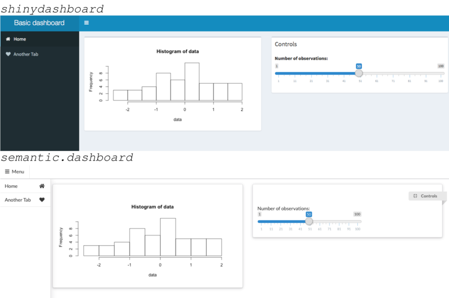
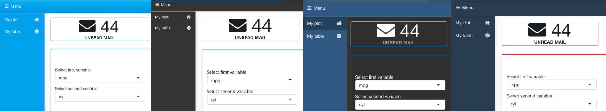

<link href="http://fonts.googleapis.com/css?family=Maven+Pro:400,700|Inconsolata" rel="stylesheet" type="text/css"> <link href='docs/style.css' rel='stylesheet' type='text/css'>

semantic.dashboard
==================

Dashboard with Semantic UI Support for Shiny

Are you fed up with ordinary `shinydashboard` look?

Give your app a new life with Semantic UI support. It cannot be any easier! Just install `semantic.dashboard` and load it instead to your app. Thanks to the compatibility with classical dashboard you don't have to start from scratch.

``` r
#########################
library(shinydashboard) # <-- You only need to change this line to: library(semantic.dashboard)
#########################
ui <- dashboardPage(
  dashboardHeader(title = "Basic dashboard"),
  dashboardSidebar(sidebarMenu(
      menuItem(tabName = "home", text = "Home", icon = icon("home")),
      menuItem(tabName = "another", text = "Another Tab", icon = icon("heart"))
  )),
  dashboardBody(
    fluidRow(
      box(plotOutput("plot1", height = 250)),
      box(
        title = "Controls",
        sliderInput("slider", "Number of observations:", 1, 100, 50)
      )
    )
  )
)

server <- function(input, output) {
  set.seed(122)
  histdata <- rnorm(500)
  output$plot1 <- renderPlot({
    data <- histdata[seq_len(input$slider)]
    hist(data)
  })
}

shinyApp(ui, server)
```



`semantic.dashboard` offers basic functions for creating dashboard with Semantic UI but not only. You can select from number of [Semantic UI Themes](http://semantic-ui-forest.com/themes/) and easily adjust the look of your dashboard.



<!-- Live demo link below -->
<!--<p style="text-align: center; font-size: x-large;">
<a href="">Live demo</a>
</p> -->

Source code
-----------

This library source code can be found on [Appsilon Data Science's](http://appsilondatascience.com) Github: <br> <https://github.com/Appsilon/semantic.dashboard>

How to install?
---------------

Install `shiny.semantic` library first. [Here](https://github.com/Appsilon/shiny.semantic) you can find how.

At the moment it's possible to install this library through [devtools](https://github.com/hadley/devtools).

    devtools::install_github("Appsilon/semantic.dashboard")

To install [previous version]() you can run:

    devtools::install_github("Appsilon/semantic.dashboard", ref = "0.1.0")

Example
-------

More examples are in the `examples` folder from the [GitHub repository](https://github.com/Appsilon/semantic.dashboard).

You can also read [this tutorial](https://appsilondatascience.com/blog/rstats/2018/06/11/dashboard-tutorial.html) to learn how to build your first semantic.dashboard app.

How to contribute?
------------------

If you want to contribute to this project please submit a regular PR, once you're done with new feature or bug fix.<br>

Changes in documentation
------------------------

Both repository **README.md** file and an official documentation page are generated with Rmarkdown, so if there is a need to update them, please modify accordingly a **README.Rmd** file and run a **build\_readme.R** script to compile it.

Troubleshooting
---------------

We used the latest versions of dependencies for this library, so please update your R environment before installation.

However, if you encounter any problems, try the following:

1.  Up-to-date R language environment
2.  Installing specific dependent libraries versions
    -   shiny.semantic

            devtools::install_github("Appsilon/shiny.semantic")

Future enhacements
------------------

-   Release of a stable 1.0 version

Appsilon Data Science
---------------------

Get in touch [dev@appsilondatascience.com](dev@appsilondatascience.com)
