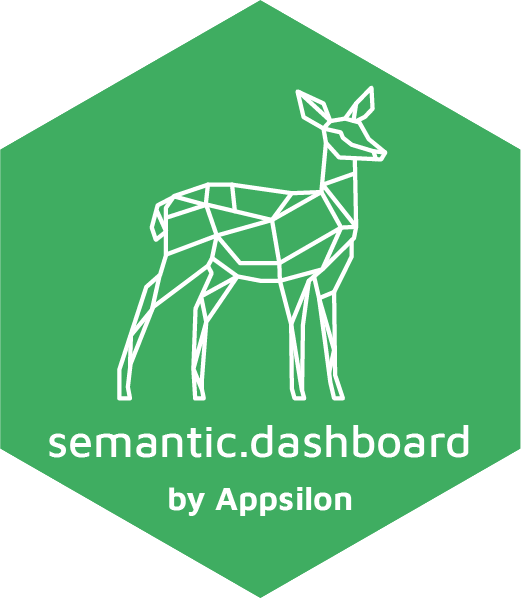
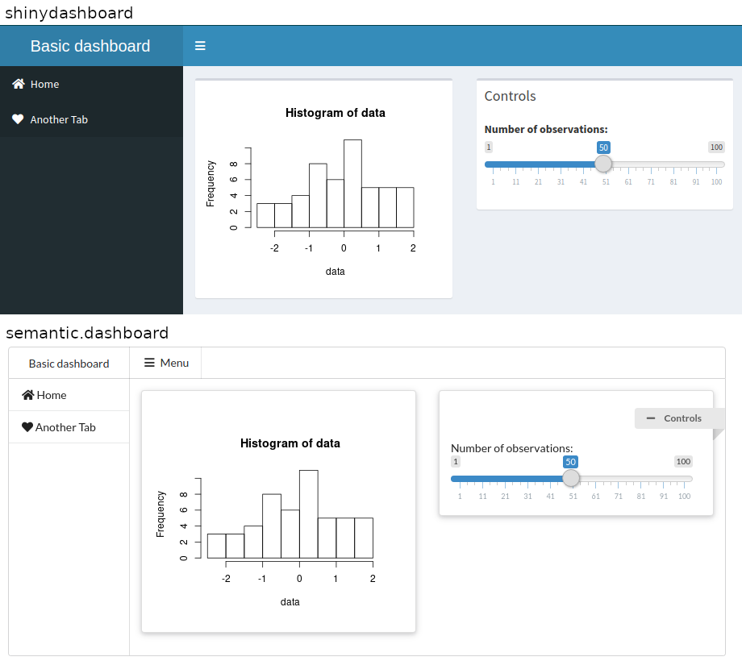

<a href = "https://appsilon.com/careers/" target="_blank"></a>



semantic.dashboard
==================


[](https://codecov.io/gh/Appsilon/semantic.dashboard)
[](https://CRAN.R-project.org/package=semantic.dashboard)
[](https://CRAN.R-project.org/package=semantic.dashboard)

Dashboard with Semantic UI Support for Shiny

Are you fed up with ordinary `shinydashboard` look?

Give your app a new fresh look with [Fomantic UI](https://fomantic-ui.com/) support.

``` r
library(shinydashboard) # <-- Change this line to: library(semantic.dashboard)

ui <- dashboardPage(
  dashboardHeader(title = "Basic dashboard"),
  dashboardSidebar(sidebarMenu(
      menuItem(tabName = "home", text = "Home", icon = icon("home")),
      menuItem(tabName = "another", text = "Another Tab", icon = icon("heart"))
  )),
  dashboardBody(
    fluidRow(
      box(plotOutput("plot1", height = 250)),
      box(
        title = "Controls",
        sliderInput("slider", "Number of observations:", 1, 100, 50)
      )
    )
  )
)

server <- function(input, output) {
  set.seed(122)
  histdata <- rnorm(500)
  output$plot1 <- renderPlot({
    data <- histdata[seq_len(input$slider)]
    hist(data)
  })
}

shinyApp(ui, server)
```



`semantic.dashboard` offers basic functions for creating dashboard with Fomantic UI but not only.

How to install?
---------------

Install `shiny.semantic` library first. [Here](https://github.com/Appsilon/shiny.semantic) you can find how.

You can install a stable version `semantic.dashboard` from CRAN repository:

    install.packages("semantic.dashboard")

The development version can be installed from GitHub using `remotes`.

    remotes::install_github("Appsilon/semantic.dashboard")

To install [previous version]() you can run:

    remotes::install_github("Appsilon/semantic.dashboard", ref = "0.1.0")

Example
-------

You can find examples in the `examples/` folder of the [GitHub repository](https://github.com/Appsilon/semantic.dashboard).

You can check [documentation](https://appsilon.github.io/semantic.dashboard/) for tutorials.

How to contribute?
------------------

If you want to contribute to this project please submit a regular PR, once you're done with new feature or bug fix.

Changes in documentation
------------------------

Both repository **README.md** file and an official documentation page
are generated with Rmarkdown, so if there is a need to update them,
please modify accordingly a **README.Rmd** file and use “Knit”.

Documentation is rendered with `pkgdown`. Just run
`pkgdown::build_site()` after rendering new **README.md**.

Troubleshooting
---------------

We used the latest versions of dependencies for this library, so please update your R environment before installation.

However, if you encounter any problems, try the following:

1.  Up-to-date R language environment
2.  Installing specific dependent libraries versions
    -   shiny.semantic

Future enhacements
------------------

-   Release of a stable 1.0.0 version
-   Closer integration with shinydashboard

Appsilon
--------


Appsilon is the **Full Service Certified RStudio Partner**. Learn more
at [appsilon.com](https://appsilon.com).

Get in touch [dev@appsilon.com](dev@appsilon.com)
