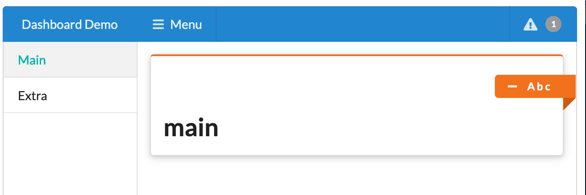

```{r setup, include = FALSE, screenshot.force = FALSE}
knitr::opts_chunk$set(
  echo = TRUE,
  collapse = TRUE,
  comment = "#>"
)
library(shiny)
library(shiny.semantic)
library(semantic.dashboard)
```

# What is a dashboard?

R Shiny is an excellent tool for interactive data visualizations. However, fitting a large number of graphs onto just one Shiny page may prove to be a challenge. In our experience, virtually all projects with new KPIs being introduced along the way result in inadequate and not readable final reports. 

Dashboards provide a solution. They allow the developer to intuitively structure their reports by breaking them down into sections, panels and tabs. This makes it much easier for the final user to navigate through the data.

# Why Semantic Dashboard?

Semantic Dashboard offers an alternative look of your dashboard based on the [Fomantic UI](https://fomantic-ui.com/). Historically, we built this package around *Semantic UI*
library, but it got deprecated and now (since December 2019) we base on the well-supported
and maintained community fork called [Fomantic UI](https://fomantic-ui.com/).

It relies and uses components from the mother package [shiny.semantic](https://github.com/Appsilon/shiny.semantic/).

# Semantic Dashboard

Basic dashboard structure is presented below.

```{r echo=T, include = T, eval = FALSE, screenshot.force = FALSE}
library(shiny)
library(semantic.dashboard)

ui <- dashboardPage(
  dashboardHeader(),
  dashboardSidebar(),
  dashboardBody()
)

server <- shinyServer(function(input, output, session) {
  
})

shinyApp(ui, server)
```

Each `dashboardPage` consists of three elements: *header*, *sidebar*, and *body*.

## Editing header

Here is one example of how to make header more interesting:

```{r echo=T, include = T, eval = FALSE, screenshot.force = FALSE}
dashboardHeader(color = "blue", title = "Dashboard Demo", inverted = TRUE)
```

Now let's add also a notification on the right:

```{r echo=T, include = T, eval = FALSE, screenshot.force = FALSE}
  dashboardHeader(color = "blue", title = "Dashboard Demo", inverted = TRUE,
                  dropdownMenu(type = "notifications",
                               taskItem("Project progress...", 50.777, color = "red")))
```

## Editing Sidebar and Body

In the sidebar we can define the references to the subpages that will be displayed in the content.
For example:

```{r echo=T, include = T, eval = FALSE, screenshot.force = FALSE}
  dashboardSidebar(
    size = "thin", color = "teal",
    sidebarMenu(
      menuItem(tabName = "main", "Main"),
      menuItem(tabName = "extra", "Extra")
    )
  )
```


**PRACTICE** *Try to add icons to the `menuItem`.*
The content of the app can be defined ike this. Note that we refer to exactly
the same `tabName` as in the sidebar.

```{r echo=T, include = T, eval = FALSE, screenshot.force = FALSE}
  dashboardBody(
    tabItems(
      selected = 1,
      tabItem(
        tabName = "main",
        box(h1("main"), title = "A b c", width = 16, color = "orange")
      ),
      tabItem(
        tabName = "extra",
          h1("extra")
      )
    )
  )
```

Note that we used `box` here with color set to *orange*. The list of all Fomantic
color you may find here: `semantic_palette`.

# Full code

The effect and complete code for this example is presented below.



```{r echo=T, include = T, eval = FALSE, screenshot.force = FALSE}
library(shiny)
library(semantic.dashboard)

ui <- dashboardPage(
  dashboardHeader(color = "blue", title = "Dashboard Demo", inverted = TRUE,
                  dropdownMenu(type = "notifications",
                               taskItem("Project progress...", 50.777, color = "red"))),
  dashboardSidebar(
    size = "thin", color = "teal",
    sidebarMenu(
      menuItem(tabName = "main", "Main"),
      menuItem(tabName = "extra", "Extra")
    )
  ),
  dashboardBody(
    tabItems(
      selected = 1,
      tabItem(
        tabName = "main",
        box(h1("main"), title = "A b c", width = 16, color = "orange")
      ),
      tabItem(
        tabName = "extra",
          h1("extra")
      )
    )
  )
)

server <- function(input, output, session) {}

shinyApp(ui, server)
```
